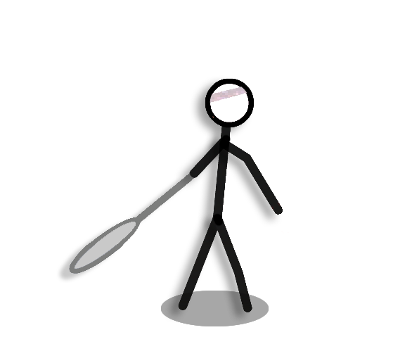

# Stick Figure Badminton  

  

种璐瑶 *2012013333*

周伯威 *2012012221*  

钱　珺 *2012013302*  

2015.04  

## 一、游戏简介

* 火柴人羽毛球灵感来自于flash小游戏  
* 游戏中，玩家可操作画面中的火柴人来进行羽毛球比赛  
* 通过键盘上的左右键控制火柴人的*左右移动*，按上键*跳跃*，按下键*挥拍击球*  
* 当某一方分数达到7分即判定取胜
* 玩家可以选择与其他玩家对战、与不同难度AI对战，以及观看AI对战  

## 二、游戏实现

### 绘图部分

该游戏为实时性游戏，为保证流畅，采用了游戏常用的**60fps**的帧率。每一帧绘制的内容包括*背景图片*、*当前比分*、*火柴人*以及*羽毛球*。  
下面分别介绍绘图部分的各个细节：  

1. **半透明图片**  
常见的*GDI*库只能绘制BMP图片，其附带的透明选项也只是选取图片左上角像素作为透明颜色，并不能实现真正的半透明绘图，画出的图片常会带有丑陋的白边。  
为了解决这一问题，我们使用了*GDI+*库，它支持各种各样的图片格式，当然也就包括含有透明通道的**PNG格式**。有了GDI+，我们也就实现了更为精美的游戏画面。
2. **双缓冲绘图**  
绘制出图片并完成一些简单的动画后，我们发现在刷新一帧时，画面会出现闪烁。想到以前使用MFC编程时曾接触过**双缓冲绘图**方法。画面出现闪烁的原因是绘图时多次把像素转移到屏幕上，而双缓冲可以先在内存中建立起一块画布，等到在内存中全部绘完，再调用BitBlt函数将像素逐个复制到屏幕上。这样便避免了画面的闪烁。
3. **局部刷新**  
GDI+固然比GDI功能强大，但它绘图效率低是不容忽视的问题。与Direct2D使用显卡绘图不同，GDI+使用的是CPU，再加上我们的游戏需要绘制很多元素，对绘图优化就显得很有必要。我们注意到，切换一帧时，并不是全部元素都需要重新绘制，因此也就可以使用**局部刷新**技术，只重绘更新了的区域。
4. **人物动画**  
在FLASH中，开发者可添加一种名为*影片剪辑*的元素，它可以做与主时间轴异步的动画，影片剪辑可以极大地方便动画的制作。然而，汇编语言并没有强大的动画制作工具，实现精细的动画也就需要很复杂的处理。  
例如，绘制人物时，手臂挥拍、脚步移动、跳起时阴影保留在地面上，这些是各自独立的。我们将小人的图像拆解开来，分别画四个部分，这就实现了游戏中小人复杂的运动。  

5. **图片旋转**  

游戏中的羽毛球并不是圆球，因此也就涉及到了旋转。我们并没有简单地制作许多张不同角度的羽毛球素材，而是只用了一张图片。  
使用GDI+中的函数**GdipImagePointsI**，可以以图片左上、右上、左下三点为基准，规定三个新的基准点，对原有矩形做线性变换，以此来完成图像的旋转。  

### 逻辑部分

1. **运动模型**  
现实中，羽毛球由于受到的空气阻力较大，其的运动轨迹不同于其他球类，**不呈现抛物线**。我们在游戏中为了还原真实性，使用了如下运动方程：
\\[
\vec a=\vec g-\gamma\cdot \vec v=\frac{{\rm d}\vec v}{{\rm d}t}
\\]
式子中，\\(\gamma\\)为空气的**粘滞系数**。  
2. **碰撞判定**  
羽毛球涉及的碰撞判定有很多：球网、地面、墙壁(球可以反弹回来!)都具有碰撞判定。在游戏中，球的运动是**离散、不连续**的，因此在每一帧计算时，球的判定点很难恰好处于墙壁等障碍物的平面上。对于球撞击障碍物反弹的动作，我们的处理方法是：
	* 使球的坐标做关于平面的对称变换
	* 使球垂直于平面方向的速度分量反向
	* 不同平面有不同的弹力系数，对应于不同的反弹速度  

	有了这样的处理，球的运动才会精确反弹。
3. **击球判定**  
击球是游戏中角色最主要的动作。游戏中击球的判定也很独特：人的可击球区域是球拍面挥动起来可达到的扇形圆环区域，羽毛球飞出的角度与速度是在击球瞬间由人与球的相对位置决定的。此外，根据球的高度不同，角色也可以自动判断应该从上方还是从下方击球。  
4. **AI**  
AI的设计可以说是本游戏的一个亮点。游戏中，分别有两个函数**leftAIconsider**与**rightAIconsider**，这些函数会根据包括羽毛球位置在内的游戏状态信息，指挥小人的行为（移动、跳跃、击球）。  
游戏内置了两个不同难度的AI，玩家亦可自行修改AI决策函数，利用AI-AI对战模式与内置的AI进行PK。

## 三、其他亮点

- 实现了背景音乐播放，并且为击球动作添加了音效
- 可以屏蔽中文输入法，避免点击字母时跳出输入法
- 创建窗口时，获取到屏幕分辨率，使窗口处于屏幕正中央
